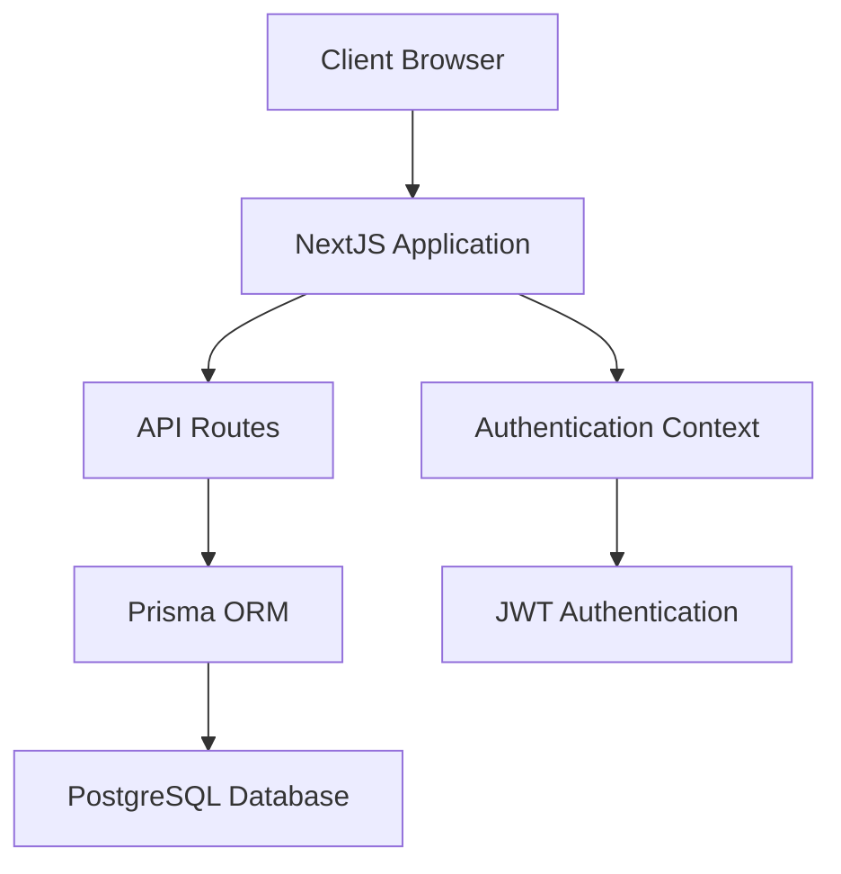
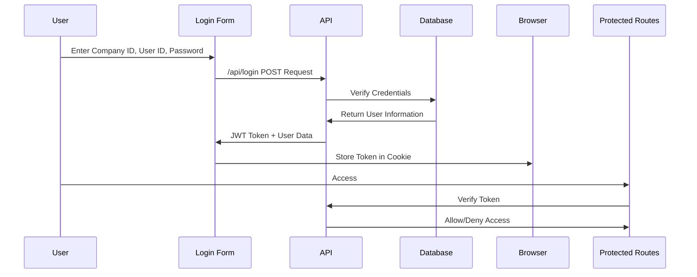
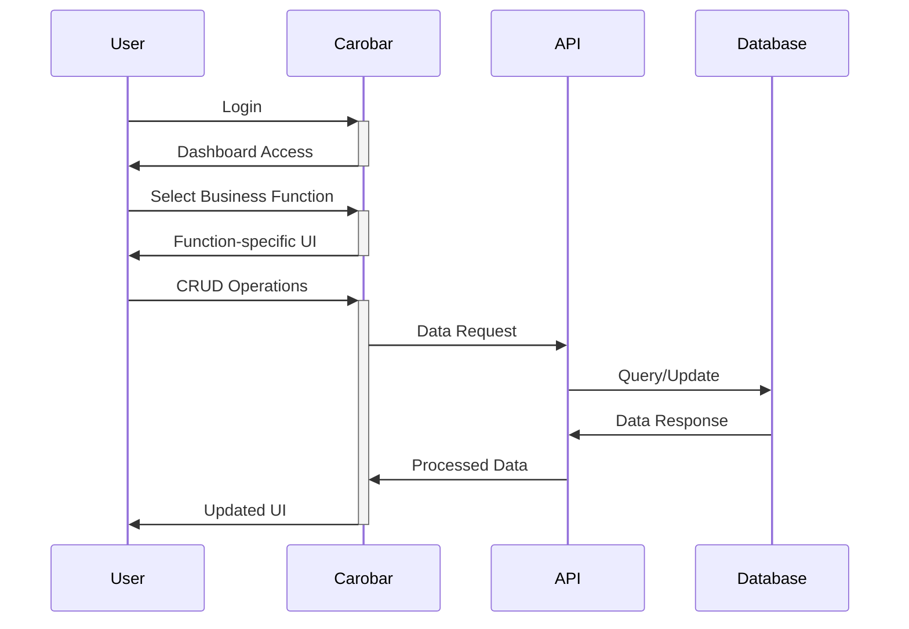

# Carobar - Architecture and Project Overview

## 1. Introduction

Carobar is a NextJS 15-based Multi-Tenent SaaS application for used car traders, focusing on the Japanese market. It is designed to manage all aspects of a vehicle trading business. The platform provides functionality for vehicle sales, purchases, stock management, reporting, invoicing, and accounting.

## 2. System Architecture

### 2.1. High-Level Architecture

Carobar follows a modern web application architecture with:



### 2.2. Technology Stack

- **Frontend**: React with Next.js 15, Tailwind CSS
- **Backend**: Next.js API Routes (Server Components)
- **Database**: PostgreSQL
- **ORM**: Prisma
- **Authentication**: JWT-based with role-based access control
- **Security**: bcrypt for password hashing
- **UI Framework**: Custom components with Tailwind CSS

### 2.3. Multi-Tenancy Model

Carobar implements a multi-tenant architecture where:

- Each company is a tenant with its own isolated data
- Company ID is used as a partition key across all tables
- Data access is filtered by company ID at the database query level
- Reference data is company-specific
- Composite keys (company_id + entity_id) are used for uniqueness

## 3. Core Components

### 3.1. Authentication System

The authentication system is built around JWT tokens:



Key components:
- `AuthContext.tsx`: Client-side authentication state management
- `authMiddleware.ts`: API route protection
- JWT stored in cookies with proper security settings
- Role-based access control for both UI elements and API routes

### 3.2. API Design Pattern

API routes follow a consistent pattern:

- Route handlers in `/app/api/` directory
- Input validation with Zod schema
- Authentication middleware (`withUser`)
- Company-specific data filtering
- Consistent error handling
- Structured responses

Example route structure for a typical entity:
- `GET` - List all records for company
- `POST` - Create new record
- `PUT` - Update existing record
- `DELETE` - Delete record

### 3.3. Database Schema Organization

The database schema follows a structured naming convention:

1. **Reference Tables**: Prefixed with `ref_`
   - Examples: `ref_bank`, `ref_color`, `ref_companies`, `ref_contact`, etc.
   - Store master data and lookup values

2. **Transaction Tables**: Prefixed with `t_`
   - Examples: `t_banktrans`, `t_journal_entry`
   - Store financial and accounting transactions

3. **Vehicle-related Tables**: Prefixed with `vehicle_`
   - Examples: `vehicle`, `vehicle_purchase`, `vehicle_sales`, `vehicle_shipment`
   - Store core business data related to vehicles

Key relationships:
- Companies are the root entities
- All reference data includes company_id
- Vehicles are identified by chassis number within a company
- Transactions reference vehicles and contacts

### 3.4. UI Component Structure

The UI is organized into reusable components:

- Layout components (`Header`, `Footer`, `Navigation`)
- UI components (`DataTable`, `FilterPanel`, `Pagination`, etc.)
- Page templates with role-based access control
- Context providers for state management

## 4. Business Modules

### 4.1. Core Business Processes

```mermaid
graph LR
    Purchase[Vehicle Purchase] --> Stock[Stock Management]
    Stock --> Sales[Vehicle Sales]
    Stock --> Repair[Repair & Maintenance]
    Stock --> Shipment[Shipment & Transport]
    Sales --> Invoice[Invoicing]
    Shipment --> Invoice[Invoicing]
    Stock --> Invoice[Invoicing]
    
    Purchase --> Accounting[Accounting]
    Sales --> Accounting
    Repair --> Accounting
    Shipment --> Accounting
    Transport --> Accounting
    Journal --> Accounting
    Bank Transaction --> Accounting
```

### 4.2. Module Overview

1. **Vehicle Management**
   - Purchase transactions
   - Vehicle details and specifications
   - Sales transactions
   - Shipment 
   - Local Transport
   - Repair Expenses


2. **Financial Management**
   - Bank transactions
   - Journal entries
   - Party accounts ( Auto Generated based on Counterparty Transactions)
   - Invoicing

3. **Reference Data Management**
   - Company configuration
   - User administration
   - Lookup data maintenance

4. **Reporting**
   - Vehicle reports
   - Financial reports
   - Operational reports

## 5. Key Implementation Patterns

### 5.1. Code Organization

- Next.js App Router structure
- Directory-based routing
- API routes parallel to UI routes
- Shared utilities in `/lib` directory
- UI components in `/components` directory

### 5.2. State Management

- Context-based state management
- Authentication state via `AuthContext`
- Form state with React's useState
- Server state with API calls

### 5.3. Security Considerations

- JWT verification for all protected routes
- Role-based access control
- Company data isolation
- Password hashing with bcrypt
- Input validation with Zod
- Secure cookie settings for tokens

### 5.4. Application Flow



## 6. Development Workflow

### 6.1. Project Structure

```
/app
  /api             # API routes
  /components      # Reusable UI components
  /contexts        # React contexts (Auth, etc.)
  /dashboard       # Dashboard pages
  /documents       # Documentation
  /lib             # Utility functions and shared code
  /login           # Authentication pages
  /prisma          # Database schema and migrations
  /styles          # Global styles
  /testdata        # Test data for development
  /transactions    # Transaction pages
```

### 6.2. Key Considerations for Developers

- All dates use YYYY-MM-DD format
- Special attention to int4 fields organized as YYYYMMDD
- System-controlled fields: created_at, created_by, updated_at, updated_by
- Multi-tenant data access patterns
- Role-based feature access
- Use comments in `app/testdata/crebas.sql` to understand  purpose of  tables and columns.
- To further understand data context, read sampke data from real world usage that I have prepared as json files in  `app/testdata/


## 7. Future Development Considerations

- Scalability for multi-tenant architecture
- Performance optimization for large data sets
- Enhanced reporting capabilities
- Mobile responsiveness improvements
- Integration with external services (payment gateways, etc.)

## 8. Conclusion

Carobar is built with modern web technologies and follows best practices for secure, scalable, and maintainable applications. The architecture supports multi-tenancy and role-based access control, making it suitable for businesses of various sizes.

The modular design allows for future expansion of features while maintaining a consistent user experience and security model. The comprehensive data model covers all aspects of vehicle trading business operations, from inventory management to financial accounting.
